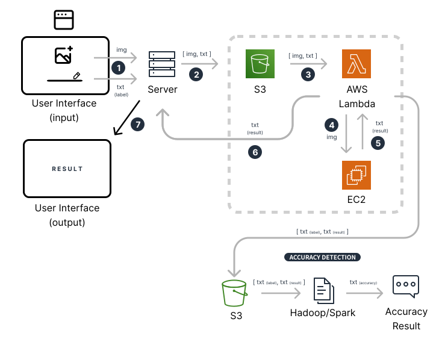

# COMP 4651 Group 9
## Cloud-based Image Classification System with AWS Services

Gonzalo Carretero (21158252) gch@connect.ust.hk 

Siyoon Park (20739700) sparkay@connect.ust.hk 

Yeung Kong Sunny Lam (20857162) ykslam@connect.ust.hk 

Gunwoo Park (20635825) gparkab@connect.ust.hk

Note: An in depth description of the project can be found in the [ProjectReport](./ProjectReport.pdf) pdf in the root of this repository.

We developed a web application and an AI model to allow users to classify images of digits, integrated into multiple AWS cloud services to provide computing and storage scalability. In particular, we made use of several EC2 instances to run the webapp and AI model, an S3 bucket to store the images and an AWS Lambda function to connect everything together.
Additionally, we added a map reduce component to the project, which processes pairs of classification predicted and true labels to determine the accuracy of our model.

This is a diagram of the architecture. Note that we run the UI and backend of the webapp in their own EC2 instances, and the processing of classifications and true lables is currently not connected to the system, but it is implemented with correct functionallity:

A video of how the system works is provided in the root of this directory: [video](resources/COMP4651GroupProject.mp4)

Additionally, you may view the video here without needing to download it: [link](https://drive.google.com/file/d/1mG-5ArxXxegJ4jyc-2LxEFV8596YTRCR/view?usp=sharing)

The webapp can be found in [webapp](/webapp) and the Convolutional Neural Network used for image classification in [AIModel](/AIModel). 

To replicate the project, please clone this repository into your local device and follow the instructions in the README.md files inside each of the above folders for further setup details.

Future versions (Implemented but not integrated for simplification):

A possible appliation of the project would be for the own users to give the true labels of the pictures they upload and the AWS Lambda will store it together with the image prediction in an S3 bucket for the map reduce to process. In the current version, the true label is already set.

The new architecure would look as follows, where the user would also give the true label of the image:

We could then give feedback to the user on for instance how "understandable" their handwritten digits are to an AI model.

For the future version, Please check directory of AIModel and accuracy-checker for detail.
